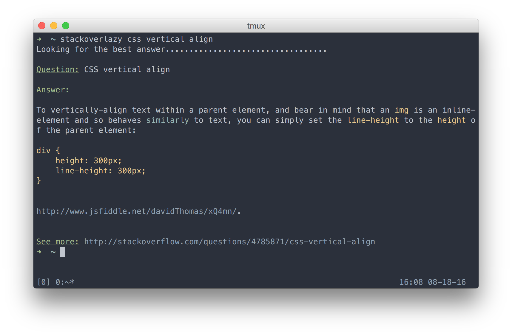

# StackOverLazy

Search for StackOverflow solution right in your terminal with colorized output.

Inspired by: https://github.com/chavdim/qstack



## Install

You can install `stackoverlazy` easily via `go get`:

```sh
go get github.com/huytd/stackoverlazy
```

## Usage

In your terminal, enter `stackoverlazy` command following with the question you want to search. For example:

```sh
stackoverlazy my code didn't compile

stackoverlazy css vertical align

stackoverlazy how to implement tower of hanoi
```

## License

This project published under **MIT** license.
